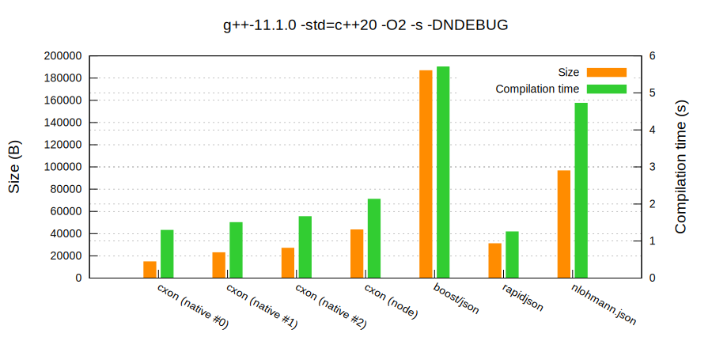
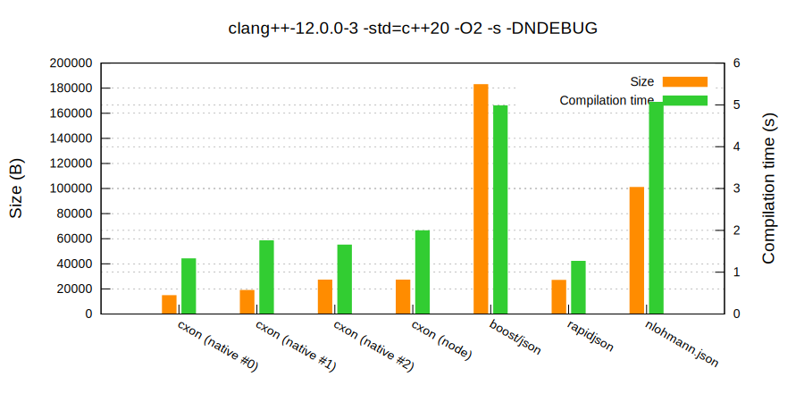

### `CXON` benchmarks

--------------------------------------------------------------------------------

##### Contents
  - Performance
    - Individual compiler figures
      - [`g++`](benchmarks/g++.md)
      - [`clang++`](benchmarks/clang++.md)
      - [`msvc++`](benchmarks/msvc++.md)
      - [`xcode`](benchmarks/xcode.md)
    - [Cross-compiler figures](benchmarks/cross.md)
    - Average per-library figures
      - [`g++`](benchmarks/g++.average.md)
      - [`clang++`](benchmarks/clang++.average.md)
      - [`msvc++`](benchmarks/msvc++.average.md)
      - [`xcode`](benchmarks/xcode.average.md)
  - [Binary size and compilation times](#binary-size-and-compilation-times)
--------------------------------------------------------------------------------

##### Binary size and compilation times

###### `g++`
  

###### `clang++`
  
