### cxon benchmarks

###### g++ / read (default)
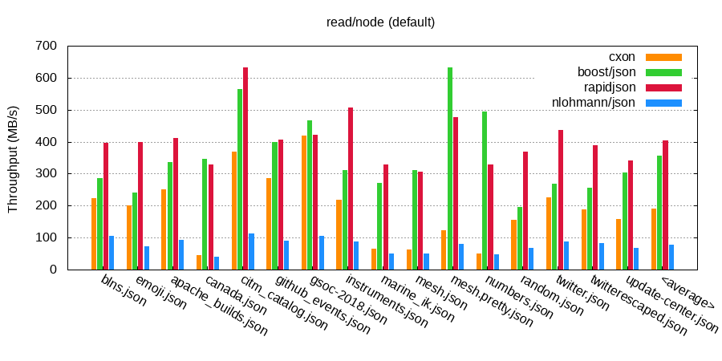
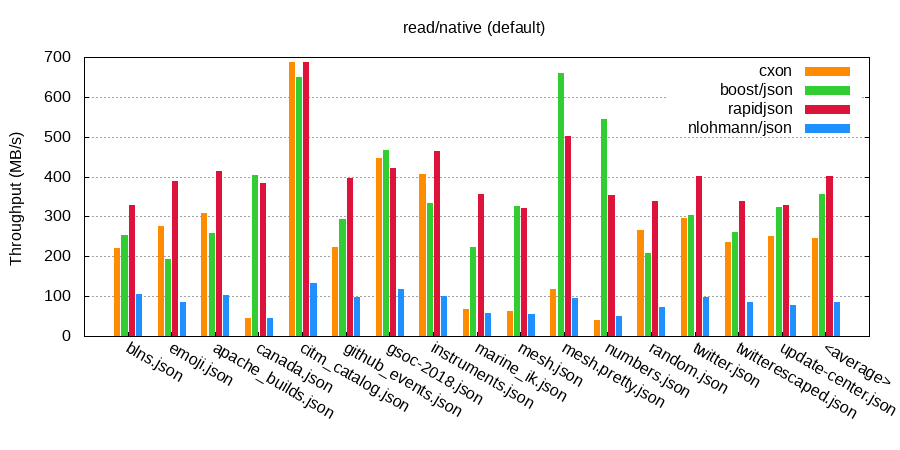

###### g++ / read (fast_float)
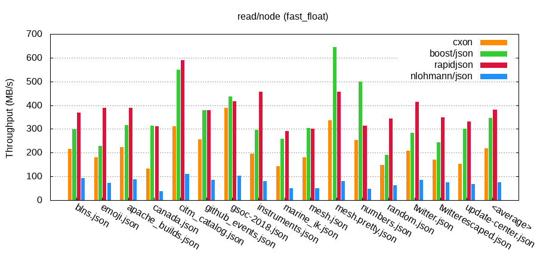
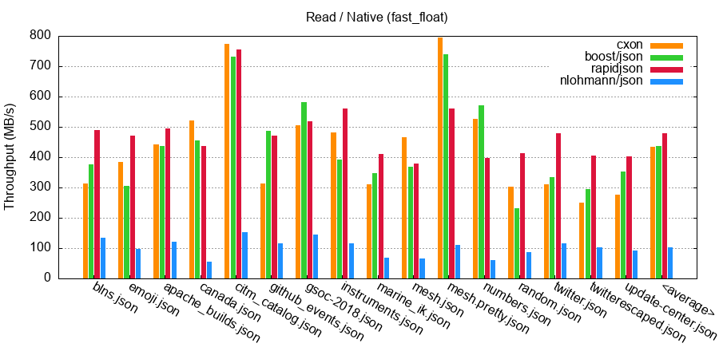

###### g++ / write (default)

###### g++ / write (fast_float)

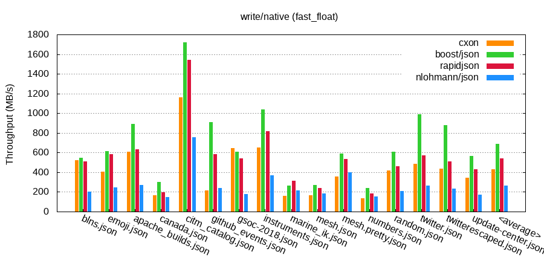

###### clang++ / read (default)
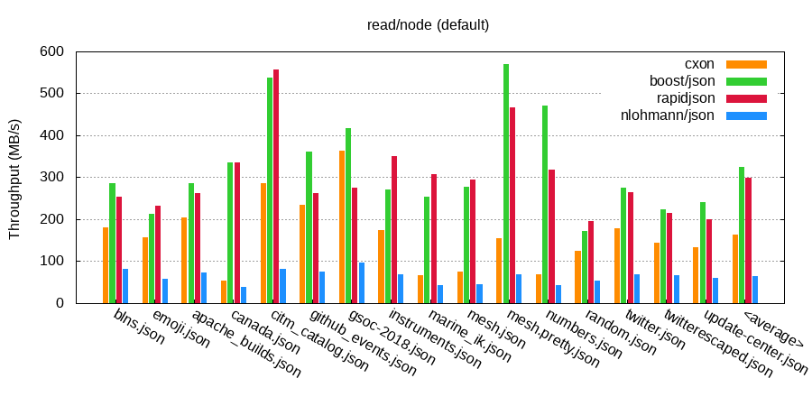
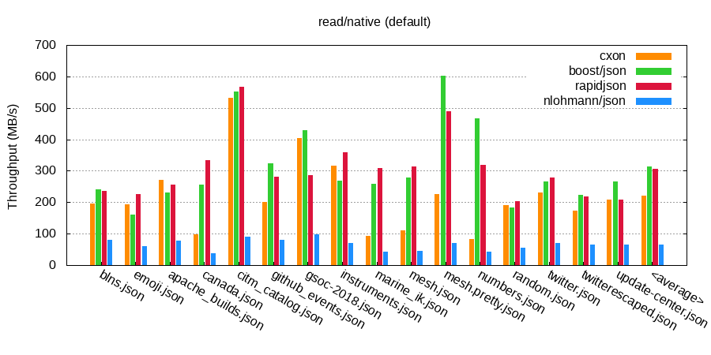

###### clang++ / read (fast_float)
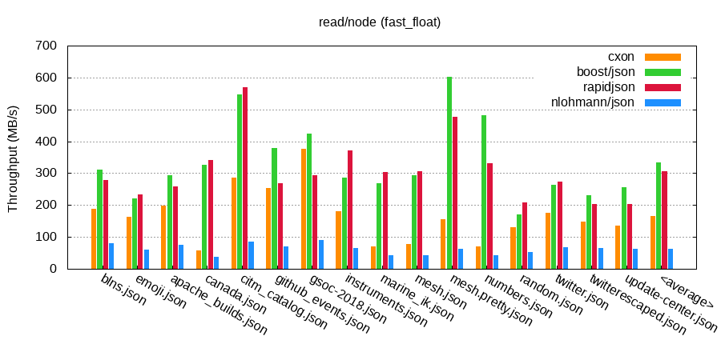
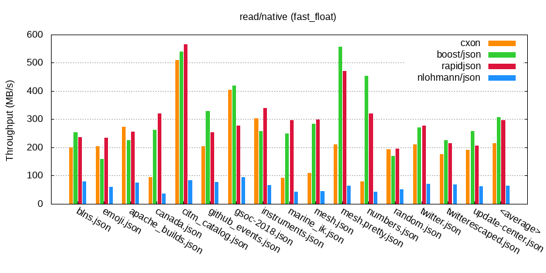

###### clang++ / write (default)
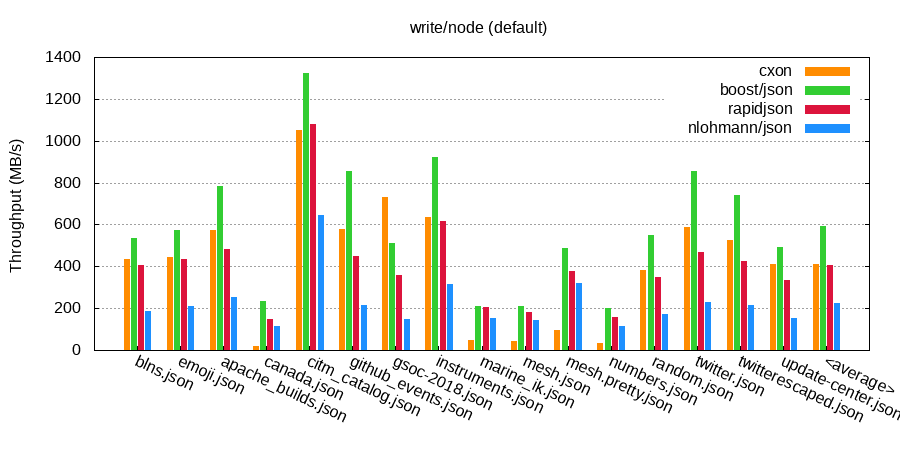
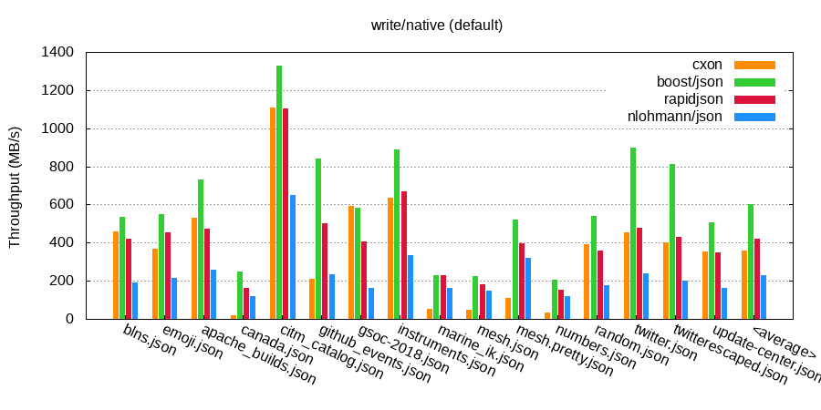

###### clang++ / write (fast_float)

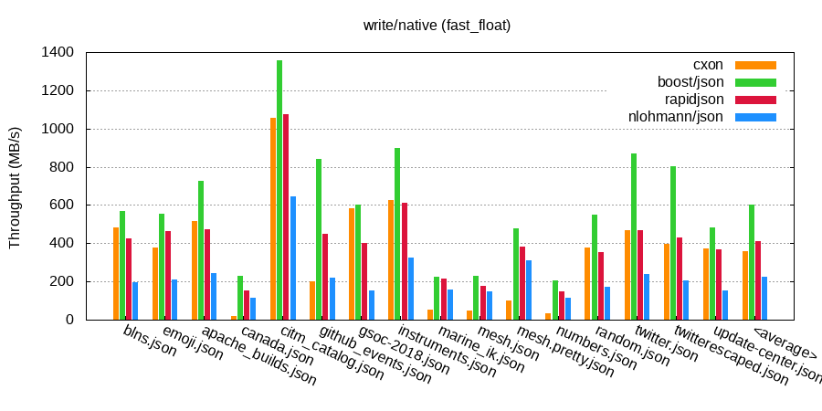
