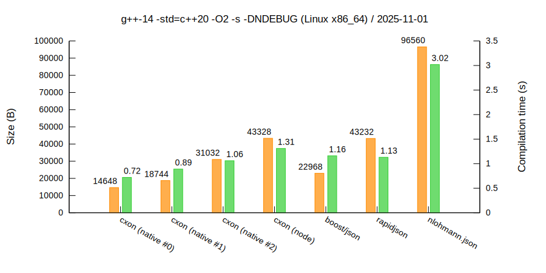
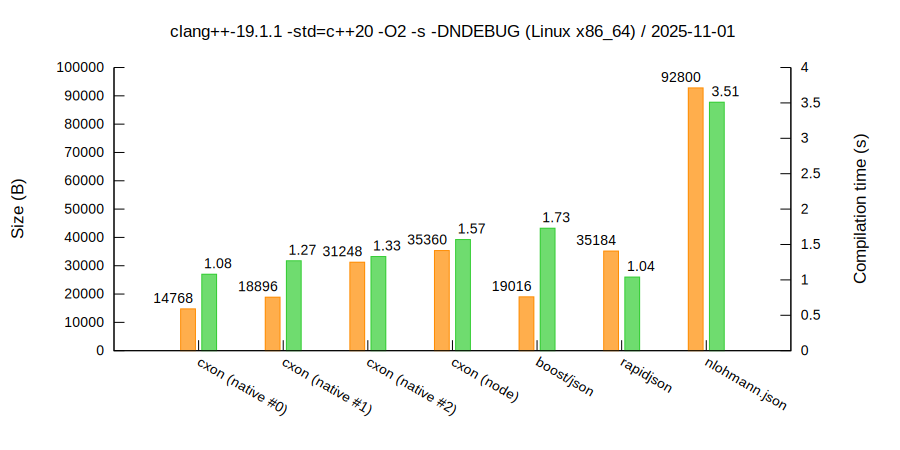
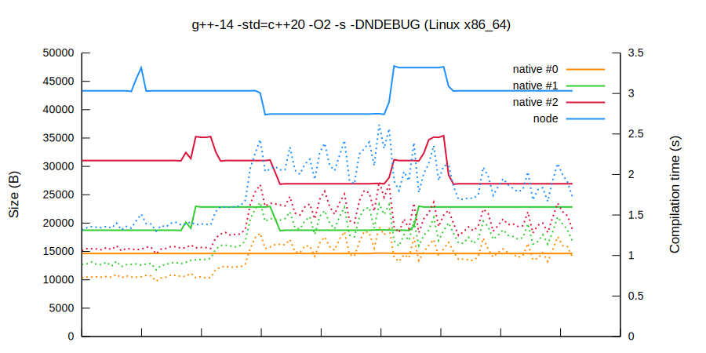
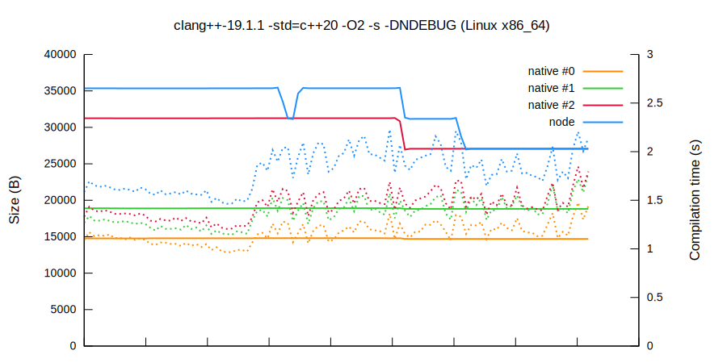

### `CXON` benchmarks

--------------------------------------------------------------------------------

##### Contents
  - Performance
    - [Per-library figures](benchmarks/compiler.md)
    - [Average per-library figures](benchmarks/average.md)
    - [Cross-compiler figures](benchmarks/cross.md)
  - [Binary size and compilation times](#binary-size-and-compilation-times)
    - [Code](#code)
--------------------------------------------------------------------------------

##### Binary size and compilation times

This benchmark runs on [`GitHub`](https://github.com/oknenavin/cxon/actions/workflows/benchmarks.yml)
against [this code](#code).  
The `cxon / native` benchmarks demonstrate that
[_you don't pay for what you don't use_](https://en.cppreference.com/mwiki/index.php?title=cpp/language/Zero-overhead_principle&oldid=118760).

###### `g++`
  

###### `clang++`
  

###### `g++` history
  

###### `clang++` history
  

###### Code

The real code can be found in `CXON` repository under `test/src/json/space`.

###### `cxon (native #0)`

``` c++
// JSON array as a vector of integers

#include "cxon/json.hxx"
#include "cxon/lib/std/vector.hxx"

int main() {
    std::vector<int> v;
        auto r = cxon::from_bytes(v, "[42]");
   return !(r && v.size() == 1 && v[0] == 42);
}
```

###### `cxon (native #1)`

``` c++
// JSON object as a struct

#include "cxon/json.hxx"
#include "cxon/lib/std/vector.hxx"
#include "cxon/lib/std/list.hxx"

struct my_type {
    std::vector<double> even;
    std::list<double> odd;
    bool operator ==(const my_type& v) const noexcept {
        return even == v.even && odd == v.odd;
    }
};

CXON_JSON_CLS(my_type,
    CXON_JSON_CLS_FIELD_ASIS(even),
    CXON_JSON_CLS_FIELD_ASIS(odd)
)

int main() {
    my_type t;
        auto r = cxon::from_bytes(t, R"({"even": [2, 4, 6], "odd": [1, 3, 5]})");
    return !(r && t == my_type { {2, 4, 6}, {1, 3, 5} });
}
```

###### `cxon (native #2)`

``` c++
// JSON object as a map

#include "cxon/json.hxx"
#include "cxon/lib/std/vector.hxx"
#include "cxon/lib/std/string.hxx"
#include "cxon/lib/std/map.hxx"

int main() {
    std::map<std::string, std::vector<double>> o;
        auto r = cxon::from_bytes(o, R"({"k":[42]})");
    return !(r && o.size() == 1 && o.find("k") != o.end() && o["k"].size() == 1 && o["k"][0] == 42);
}
```

###### `cxon (node)`

``` c++
// JSON object as a polymorphic type

#include "cxon/json.hxx"
#include "cxon/lib/node.hxx"

int main() {
    using node = cxon::json::node;
     node n;
        auto r = cxon::from_bytes(n, "[42]");
    return !(r && n.is<node::array>() && n.get<node::array>().size() == 1 && n.get<node::array>()[0] == 42);
}
```

###### `boost/json`

``` c++
#define BOOST_JSON_STANDALONE /* TODO: deprecated */
#include "boost/json/src.hpp"

int main() {
    boost::json::error_code ec;
    boost::json::value v = boost::json::parse("[42]", ec);
    return !(ec == std::errc{} && v.is_array() && v.as_array().size() == 1 && v.as_array()[0] == 42);
}
```

###### `rapidjson`

``` c++
#include "rapidjson/document.h"

int main() {
    rapidjson::Document d;
    rapidjson::ParseResult r = d.Parse("[42]");
    return !(r && d.IsArray() && d.GetArray().Size() == 1 && d.GetArray()[0] == 42);
}
```

###### `nlohmann.json`

``` c++
#include "nlohmann/json.hpp"

int main () {
    nlohmann::json j;
    try {
        j = nlohmann::json::parse("[42]");
    }
    catch (...) {
        return -1;
    }
    return !(j.is_array() && j.array().size() == 42 && j.array()[0] == 42);
}
```

