### `CXON` benchmarks / `clang++`

--------------------------------------------------------------------------------

###### Read
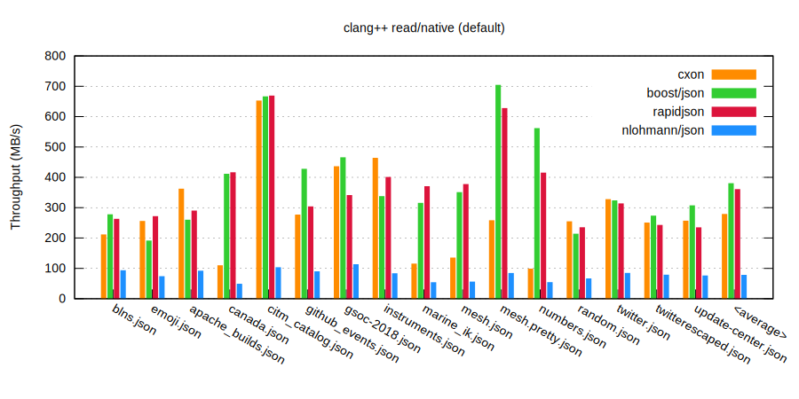
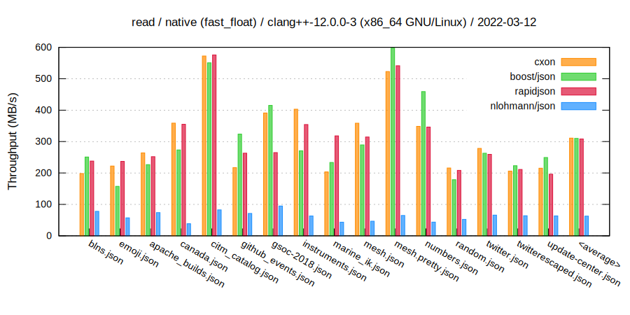
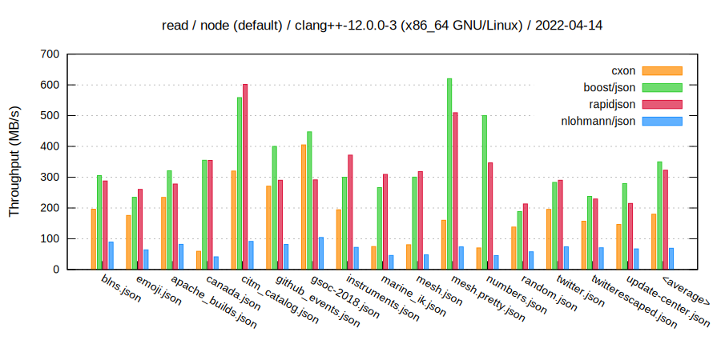
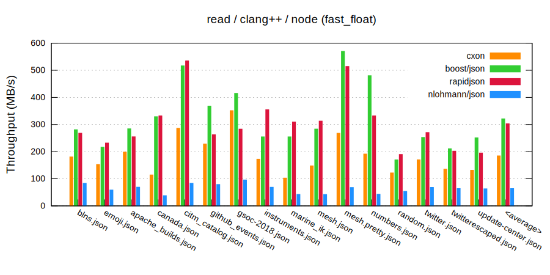

###### Write
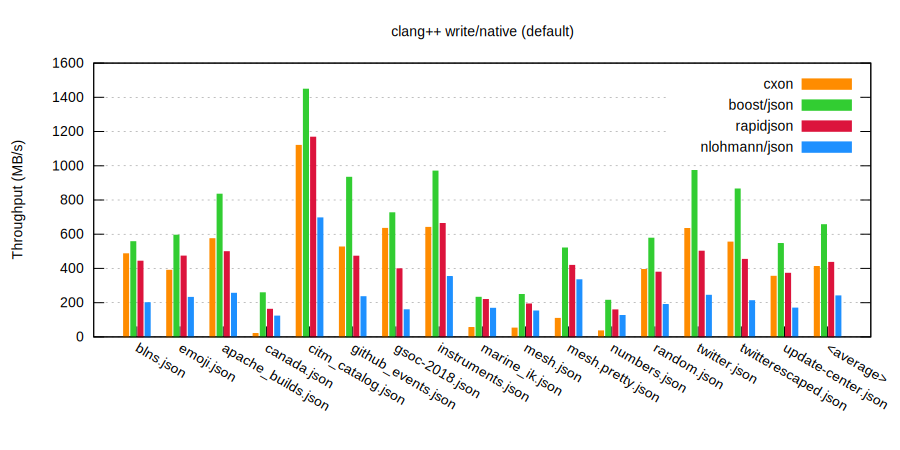

###### Read - history
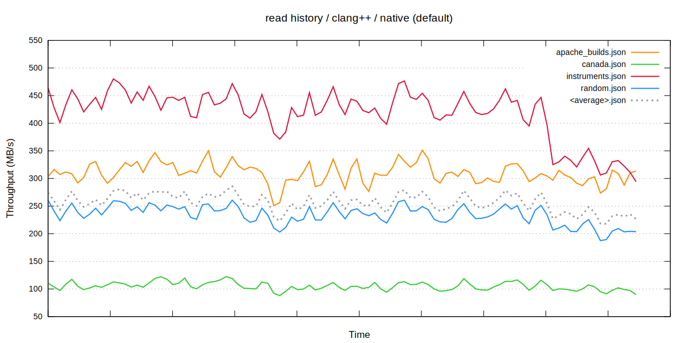
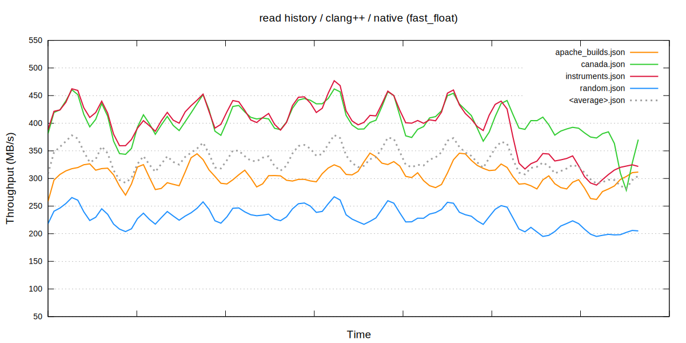
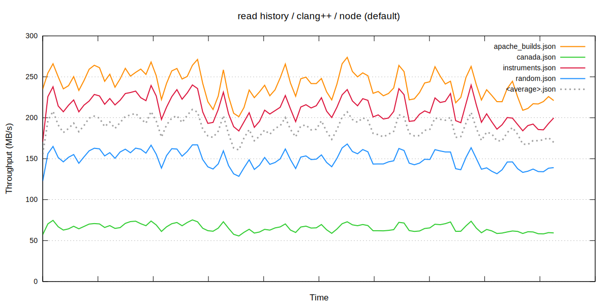
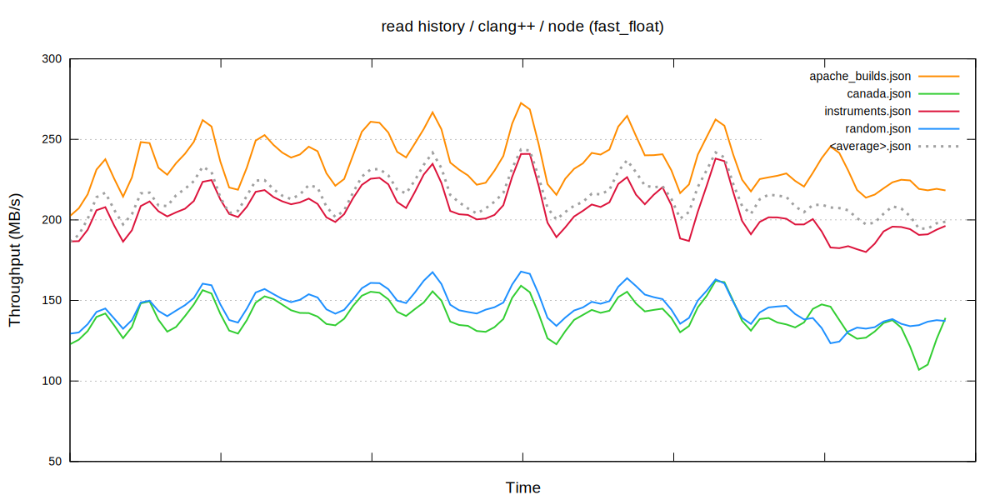

###### Write - history
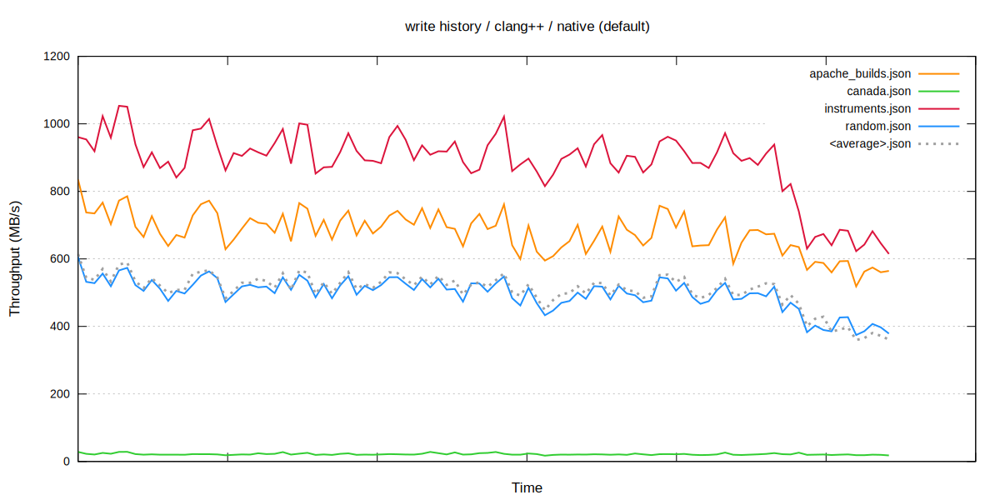
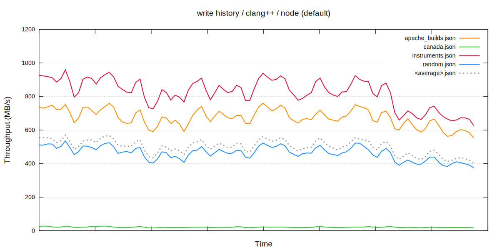
