### `CXON` benchmarks / `g++`

--------------------------------------------------------------------------------

###### Read
  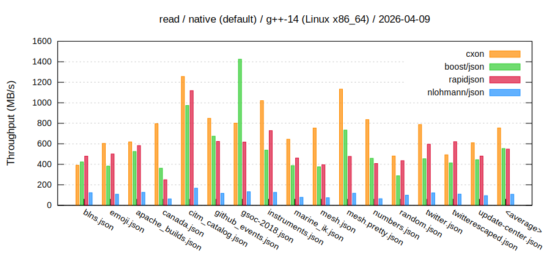
  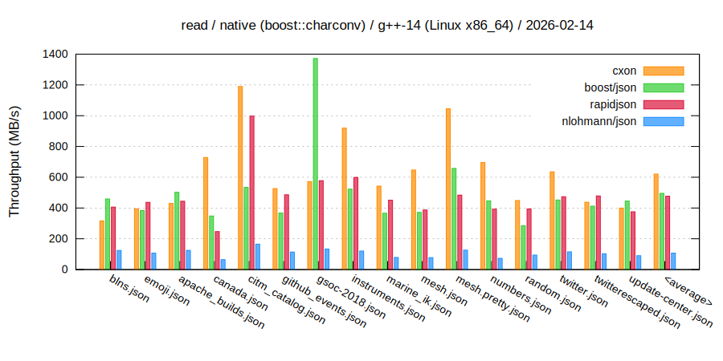
  
  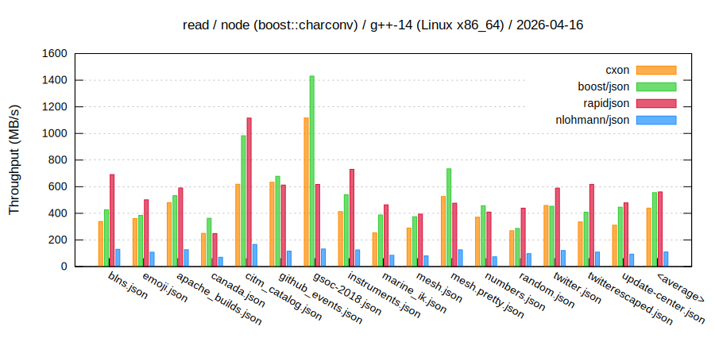

###### Write
  
  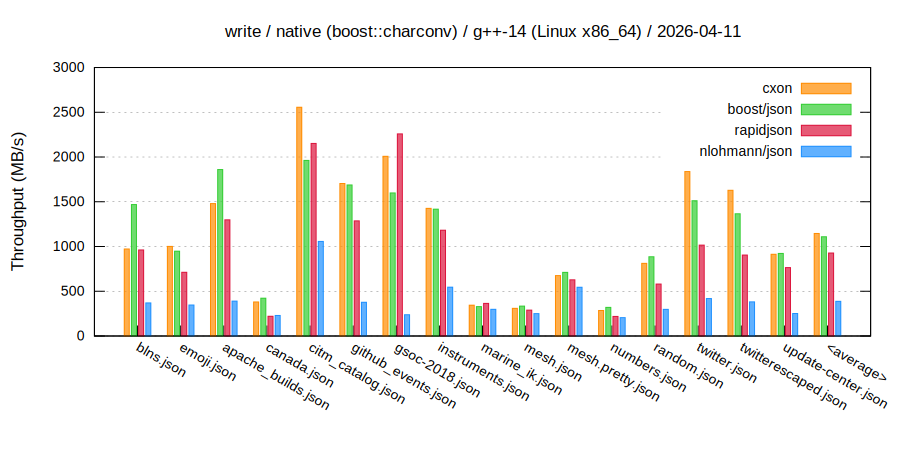
  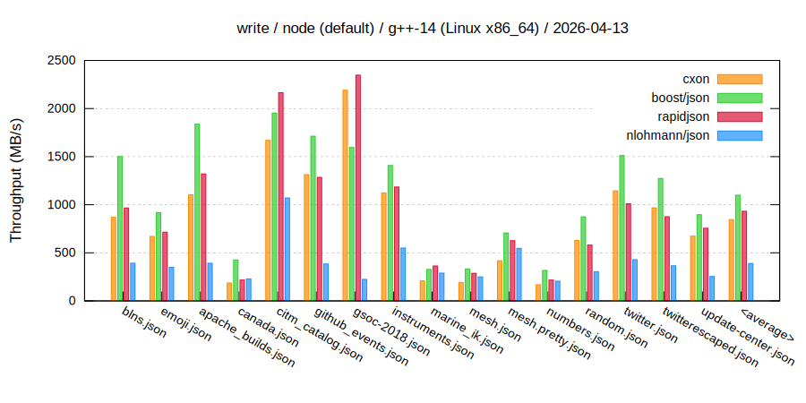
  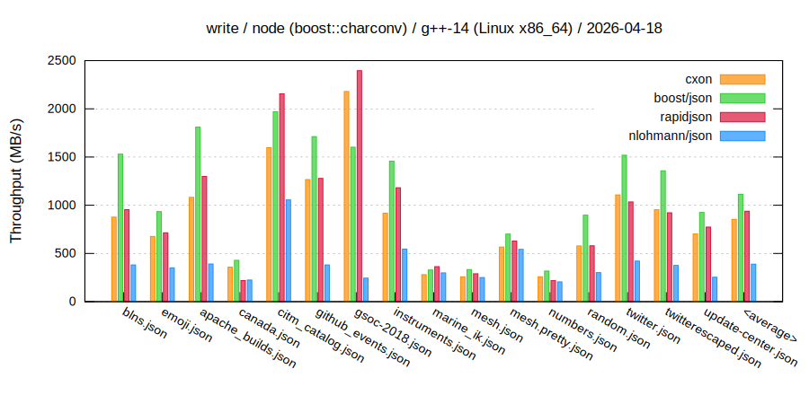

###### Read history
  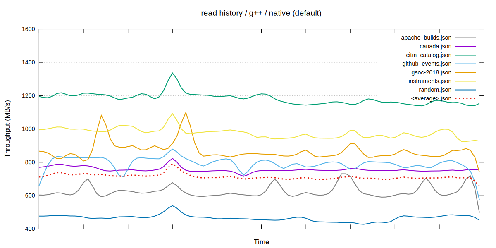
  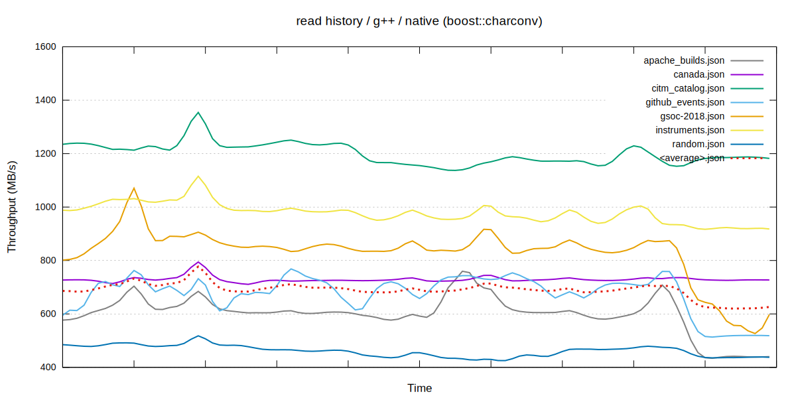
  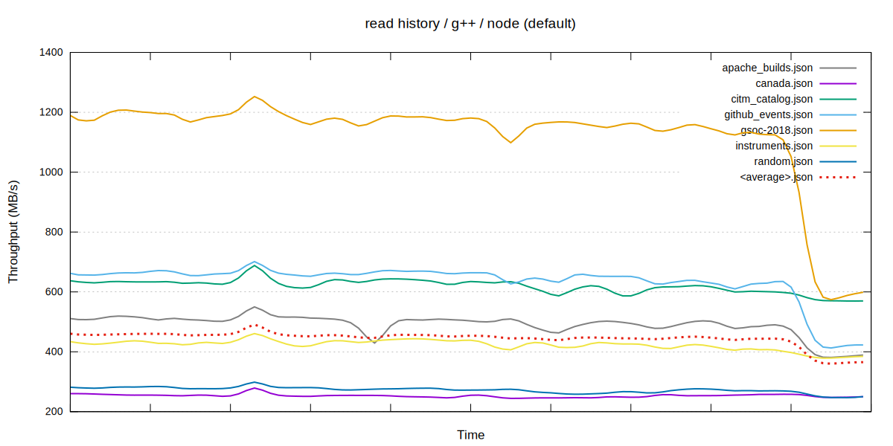
  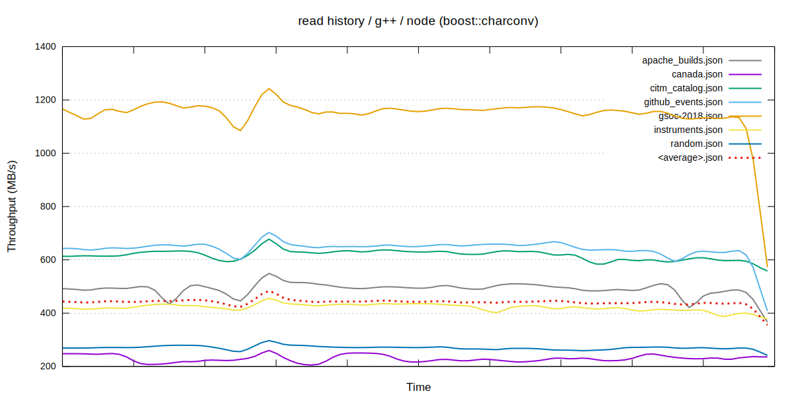

###### Write history
  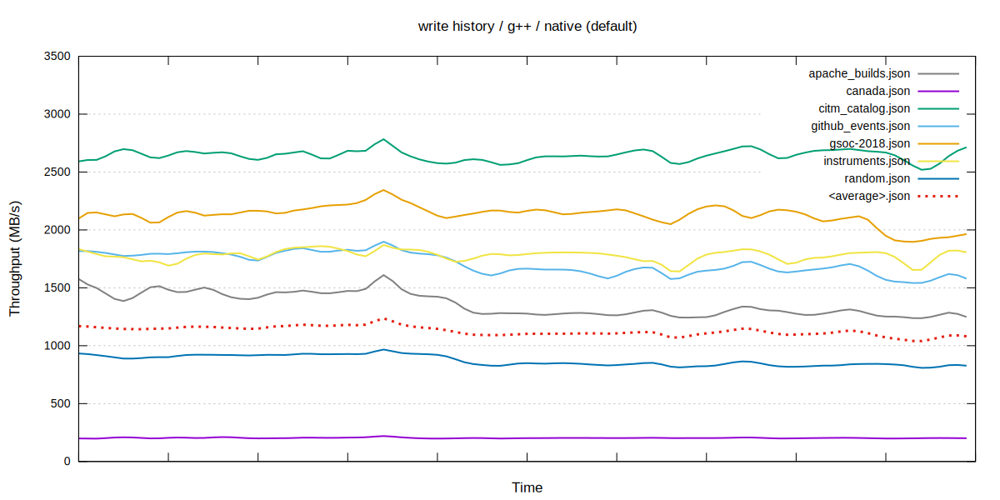
  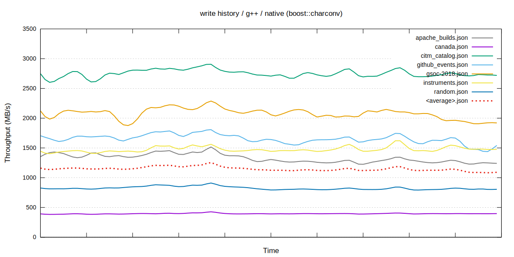
  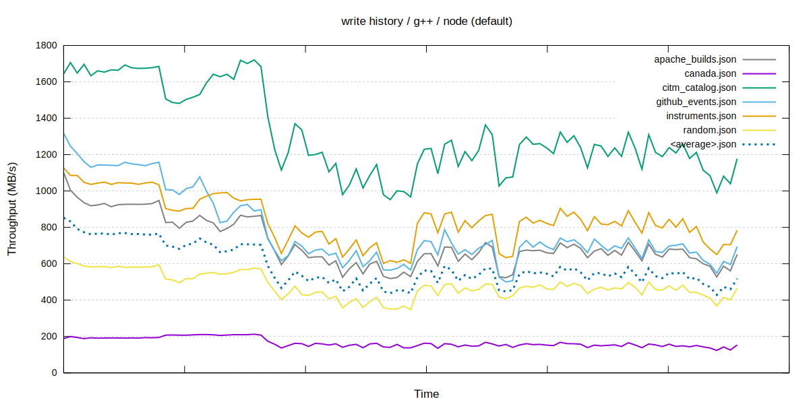
  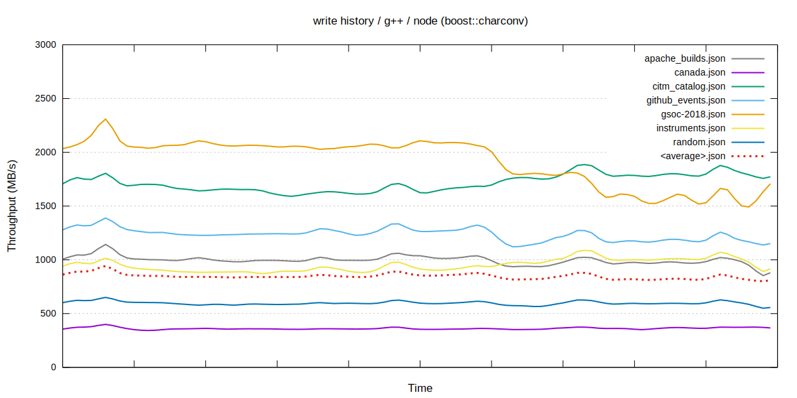
