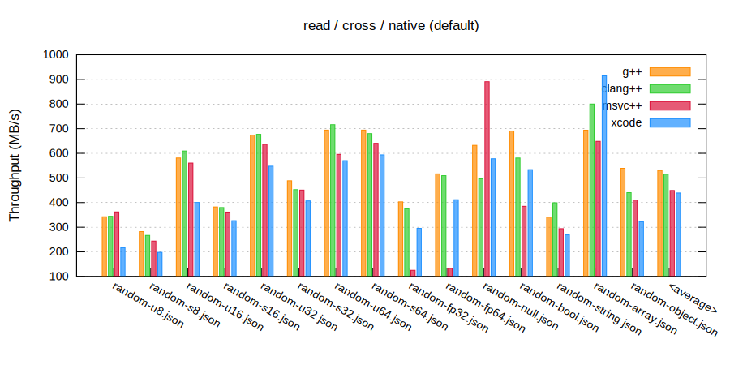
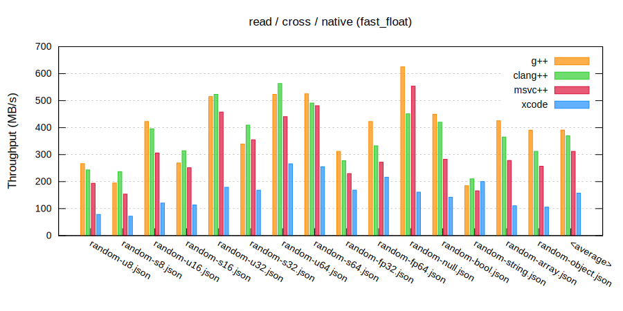
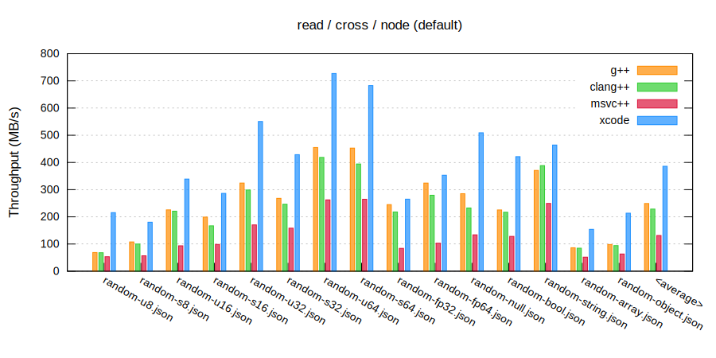
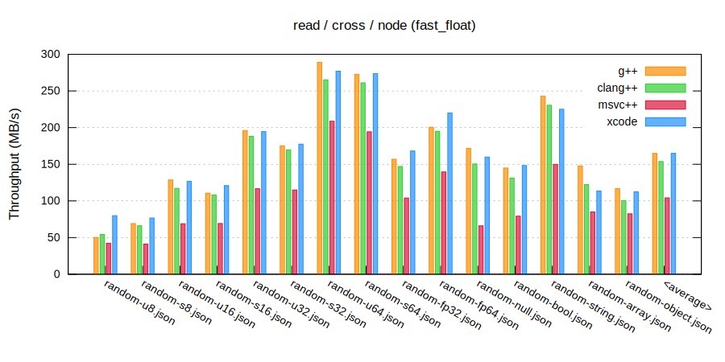
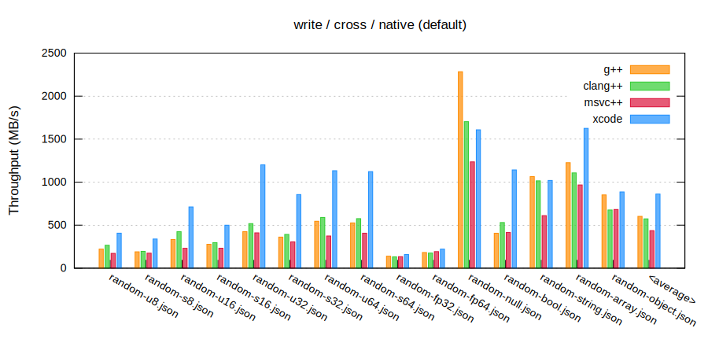
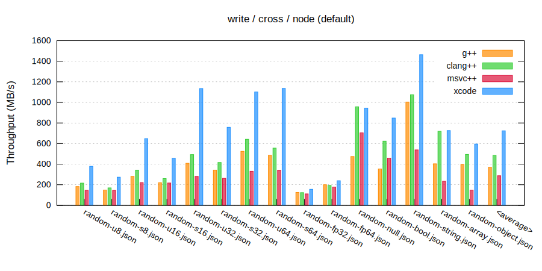

### `CXON` benchmarks / `cross-compiler`

--------------------------------------------------------------------------------

#### Set #1

###### Read
  
  
  
  

###### Write
  
  

#### Set #2

###### Read
  
  
  
  

###### Write
  
  
