### `CXON` benchmarks / `xcode`

--------------------------------------------------------------------------------

###### Read
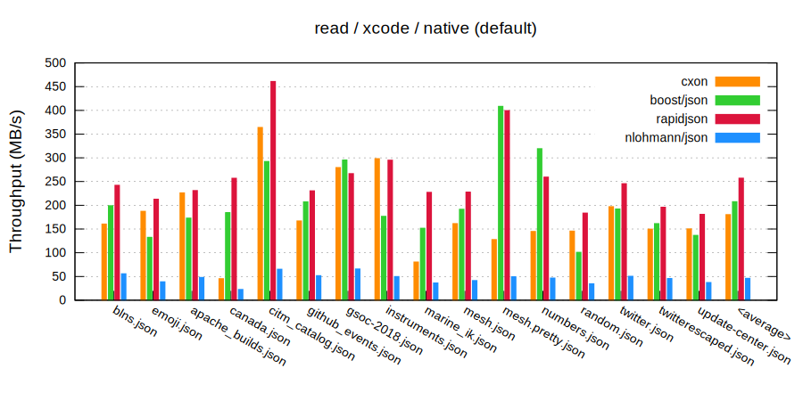
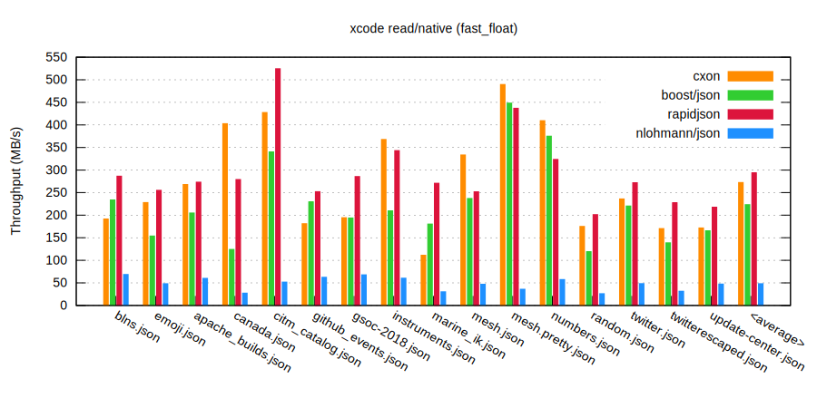
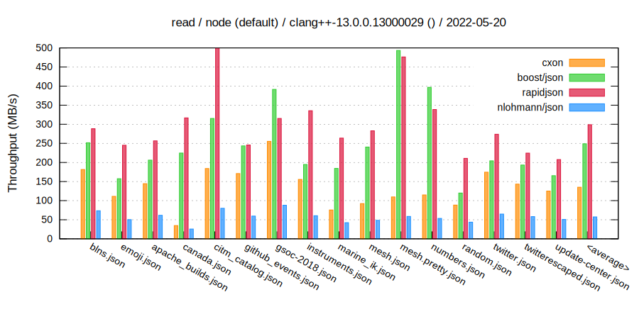
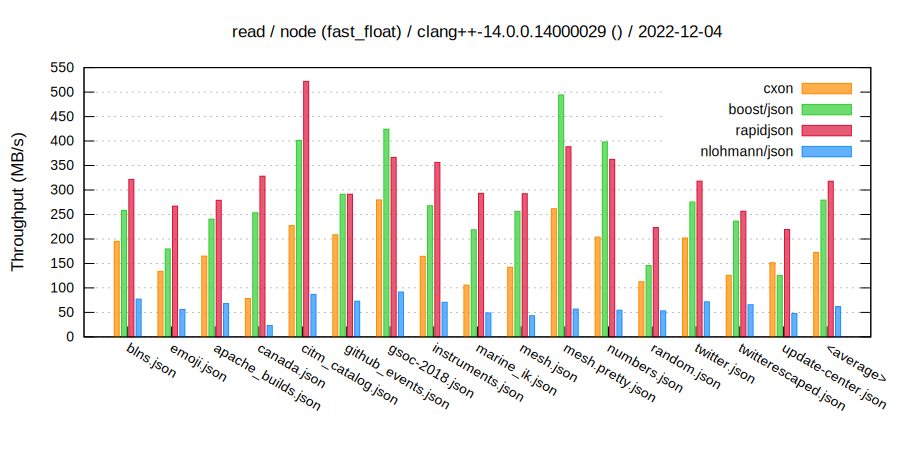

###### Write
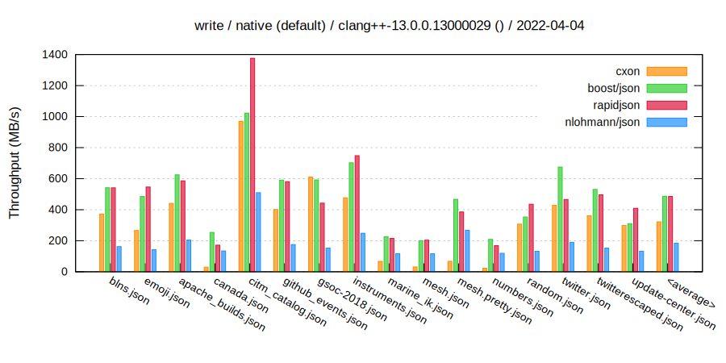
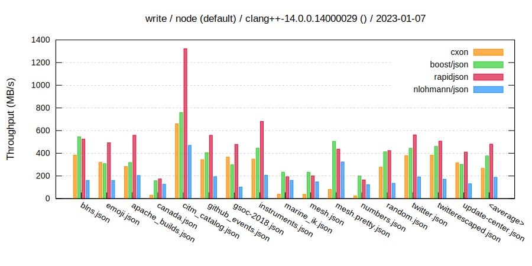

###### Read - history
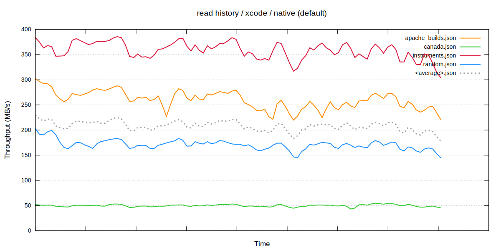
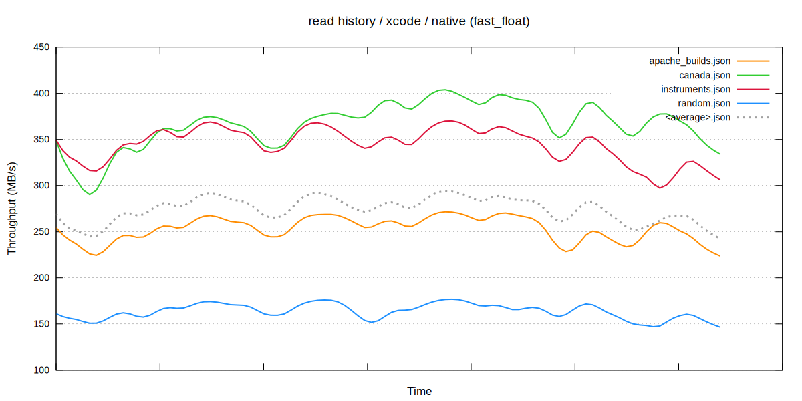
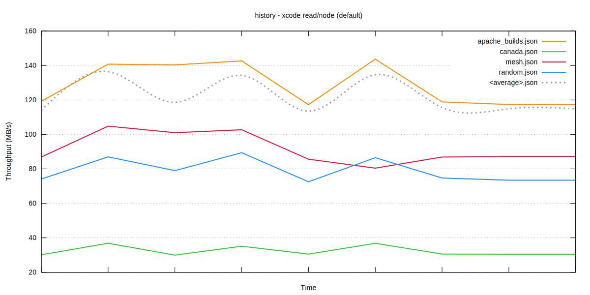
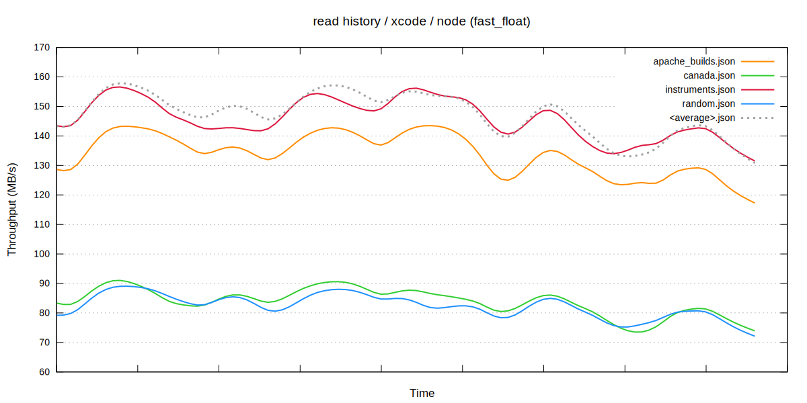

###### Write - history
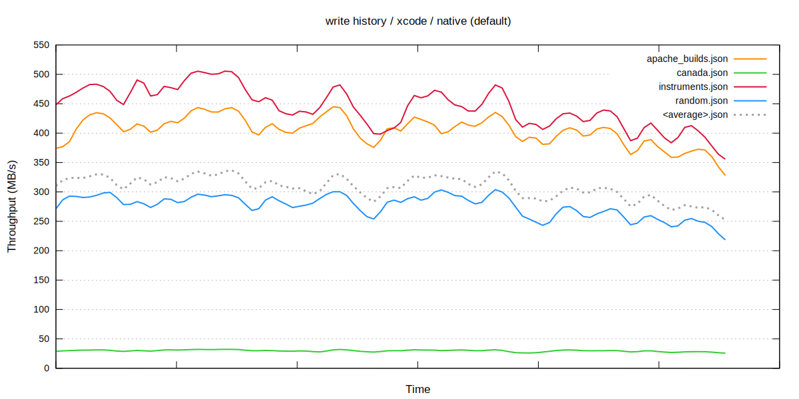
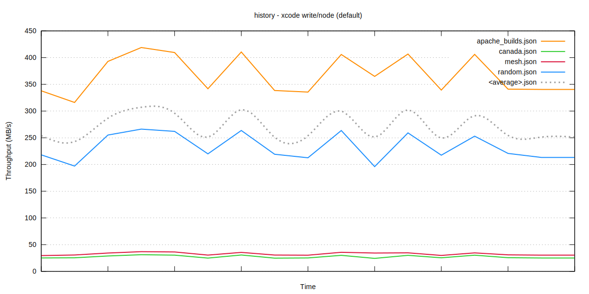
